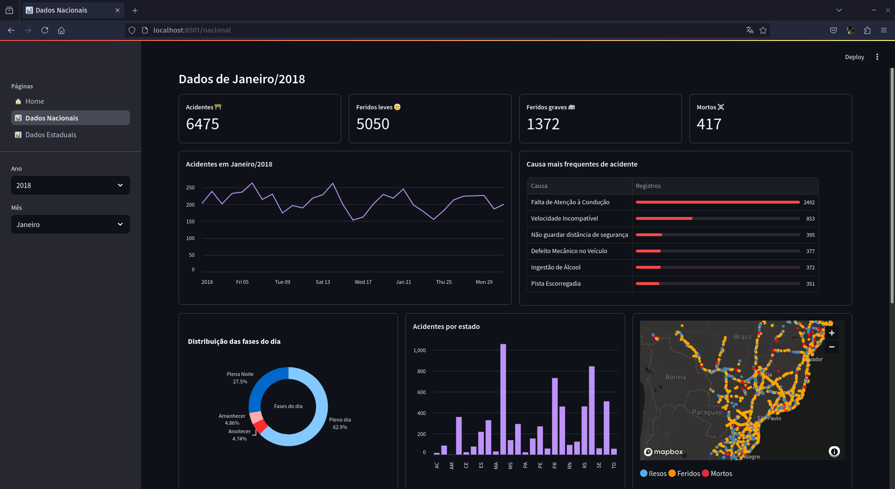

# Trabalho final da disciplina de Organização de Dados 1 (ICP 142)

## Objetivo

Aplicar conceitos de organização e análise de dados usando a linguagem Python. A tarefa será dividida em duas partes:

- **Análise de dados** utilizando Pandas para manipulação de dados e Matplotlib (ou outra biblioteca de visualização) para gerar gráficos que representem os resultados.
- **Construção de um dashboard** interativo utilizando Streamlit, no qual o usuário poderá explorar os dados e as visualizações de forma dinâmica.

**Dados utilizados**: [Car Accidents in Brazil (2017-2023) - Kaggle](https://www.kaggle.com/datasets/mlippo/car-accidents-in-brazil-2017-2023)

## Dashboard
Disponível em: [streamlit.app](https://car-accidents-brazil.streamlit.app/).

